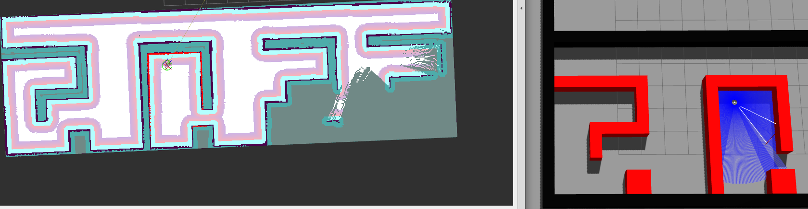

# Test Log

## World 1

### 2023-10-10 16:00:00

The environment more or less passes, however, please address the following issues:

- set the initial goal in your code - you can sample points around you and randomly pick one that is near and reachable
- change the strategy of always going to the furthest frontier point - it makes the robot travers there and back across the entire known map - our test environments are quite big and it makes your solution very inefficient
- use some clustering algorithm to filter out too small frontier points - right now your algorithm is trying to resolve every single point and when they don't get cleared, it keeps coming back to them (thanks to the issue from the previous point)

